<h1 align="center">👋 Hi everyone, I'm <b>Petimat</b></h1>

  💻 <b>Backend Developer (Go)</b> 

---

### ✨ About me

-🧱 I build minimalist and sustainable services on Go
- 🎯 I'm developing in backend architecture, REST and testing
- 🤝 Open to joint projects and interesting tasks

  
  
  

---

### ⚙️ Tech Stack

  
  
  
  

---

### 📌 Pinned projects
- [go-fitness-tracker](https://github.com/SPetkaa/go-fitness-tracker) — трекер активности (Go, REST)
- [go-calc-and-win](https://github.com/SPetkaa/go-calc-and-win) — CLI-игра на Go
- [final-project-encoding-go](https://github.com/SPetkaa/final-project-encoding-go) — финальный проект (Go, JSON)

---

### 📊 GitHub Stats

  
  

---

### 🧮 Metrics Dashboard

  

---

### 🏆 Achievements & Streak

  
    
  

---

<i>“Code. Learn. Improve. Repeat.”</i>

